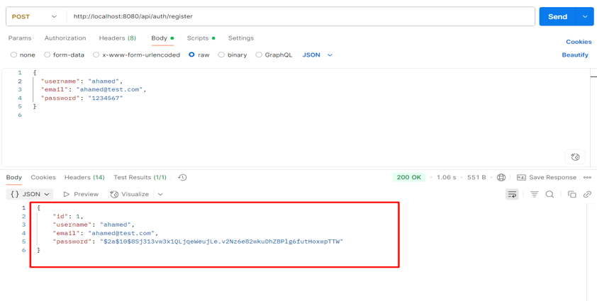
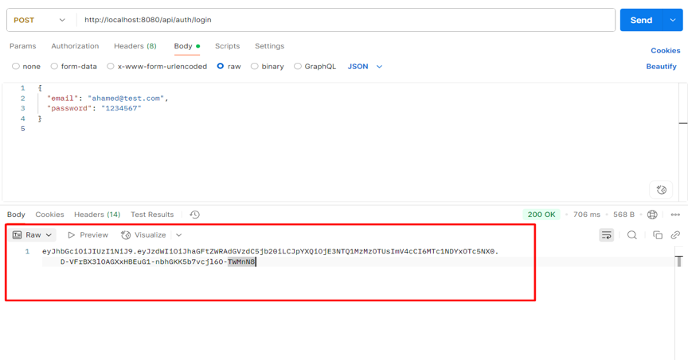
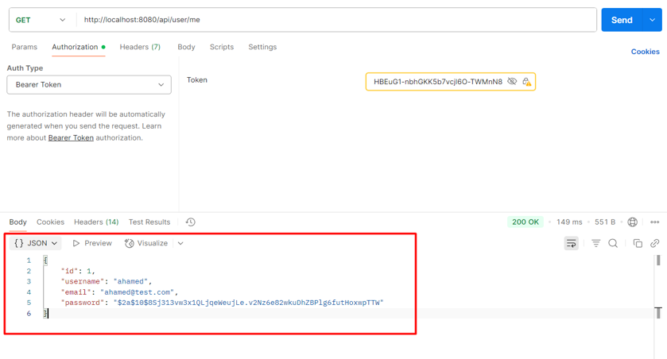

# Spring Boot Authentication API

This project provides a simple User Authentication API using Spring Boot, Spring Security, JWT, and MySQL.

## 🔧 Features
- ✅ User Registration (`/api/auth/register`)
- ✅ User Login (`/api/auth/login`) — returns JWT token
- ✅ Get Current User Info (`/api/user/me`) — requires Bearer token

## 💻 Requirements
- Java 17+
- Maven
- MySQL (XAMPP or local)

## ⚙️ Setup Instructions

1. Start MySQL and create a database:
   ```sql
   CREATE DATABASE auth_db;
   ```
2. Open the project and update `src/main/resources/application.properties` with your DB credentials if needed.

3. Run the project:
   ```bash
   mvn spring-boot:run
   ```

## 📬 API Testing (via Postman)

### 🔹 Register
**POST** `http://localhost:8080/api/auth/register`

Request Body:
```json
{
  "username": "syed",
  "email": "syed@test.com",
  "password": "123456"
}
```

### 🔹 Login
**POST** `http://localhost:8080/api/auth/login`

Request Body:
```json
{
  "username": "syed",
  "password": "123456"
}
```

✅ Response: JWT Token

### 🔹 Get User Info
**GET** `http://localhost:8080/api/user/me`

**Headers:**
```
Authorization: Bearer <JWT_TOKEN>
```

### 📸 Sample Request in Postman



### 🔐 Login Response



### 🔍 Get User Info (with Bearer token)



